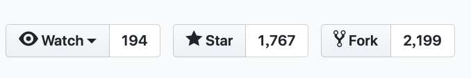
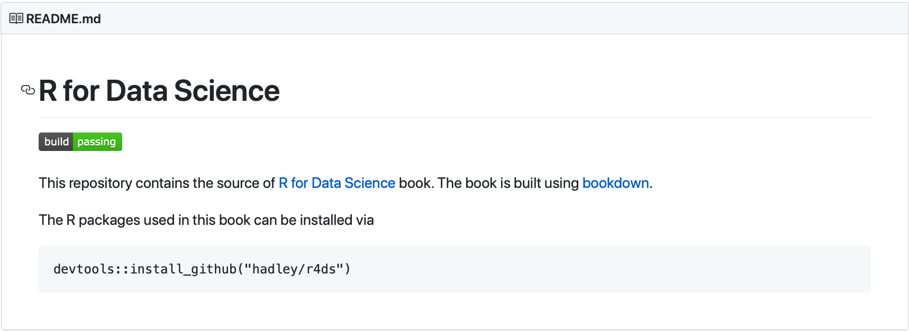
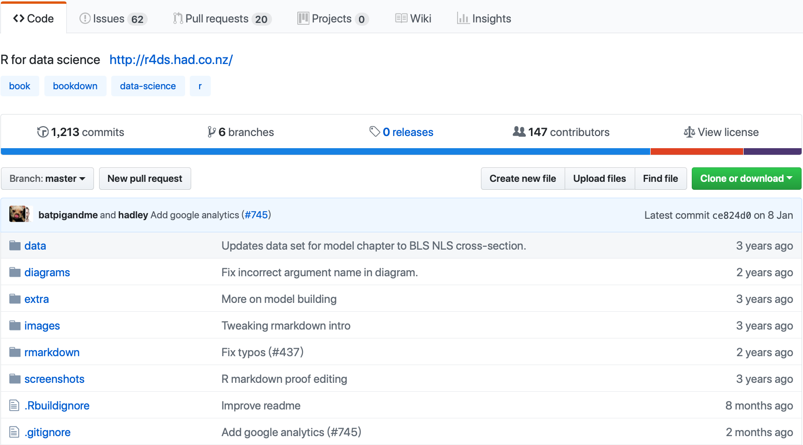
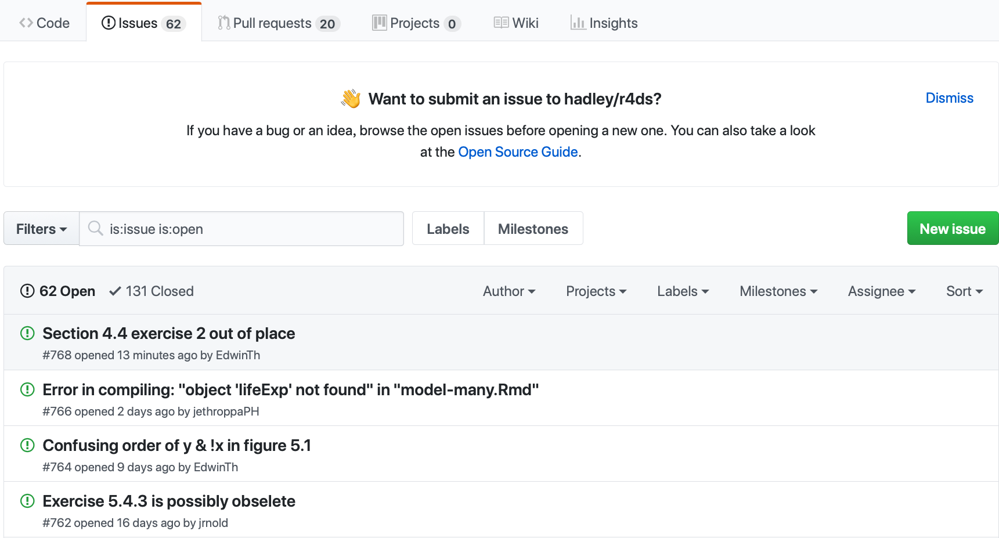
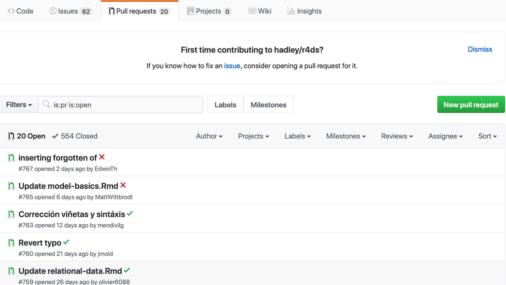
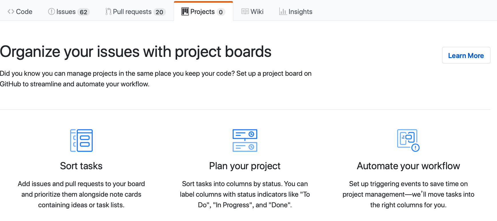
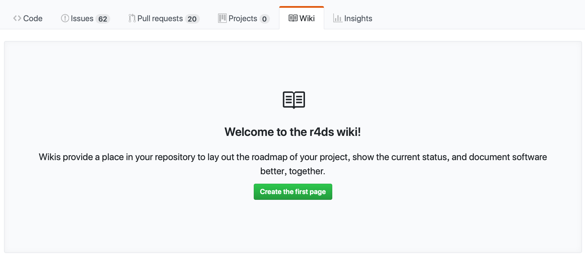

# (PART) Part I: Github {-} 

# GitHub

### GitHub與Git之間的關係{-}

> 如果你有在用Git，你不一定會用到GitHub；但若你有用GitHub，你一定有在用Git

1. Git是一套協助開發者進行版本控制的程式。

2. GitHub = Git + Hub。

  - Hub本身可以理解為中心、樞紐的意思，略有集散地的感覺。

  - GitHub本身是一個雲端儲存程式檔案的一個平台，讓許多開發者可以藉此進行雲端備份、遠距共同開發（這樣就不用每天都要進辦公室討論XD），交流新技術的地方。目前也是全球最大的~~男性~~開源程式碼（Open Source）交流平台。

  - 可以理解為開發者圈子的臉書。許多人也會藉此展現自己的作品集作為爭取工作機會的籌碼。

  - 一個簡單的反例是[GitLab](https://about.gitlab.com)，所以其實GitHub所提供的程式碼備份（託管）服務並不是唯一。

3. Git世界裡面的資料夾叫做repository(repo)，可以理解為儲存庫。只要有賦予其版本控制的資料夾都是一個repo。

### GitHub環境介紹{-}

> 以下內容示範截圖皆以[R for Data Science](https://GitHub.com/hadley/r4ds)以及[PoMingChen/GitDemo](https://GitHub.com/PoMingChen/GitDemo)這兩個repo作為說明

#### Fork{-}

<div class="alert white">
截圖<a data-toggle="collapse" href="#collapseExample" role="button" aria-expanded="false" aria-controls="collapseExample"><i class="fa fa-image"></i></a>
</div>

```{r, eval=TRUE, echo=FALSE}
library(htmltools)
HTML('
<div class="collapse" id="collapseExample">
<h3>第一部分</h3>

<h3>第二部分</h3>

</div>
     ')
```

- **作用**：把別人整個repo複製到我的GitHub帳戶底下，我因此有了完整的屬於我的另外一份。
- **使用時機**：**目的在參與**。當看到自己有興趣的專案，想要進一步玩玩或者做出貢獻，為了避免損及（更動）到原本作者的東西，就需要Fork自己的一份回來，改好之後就可以再送pull request（section ? ）給原作者。

#### Watch & Star{-}

<div class="alert white">
截圖<a data-toggle="collapse" href="#collapseExample2" role="button" aria-expanded="false" aria-controls="collapseExample"><i class="fa fa-image"></i></a>
</div>

```{r, eval=TRUE, echo=FALSE}
library(htmltools)
HTML('
<div class="collapse" id="collapseExample2">
<h3>第一部分</h3>

</div>
     ')
```

- **作用**：關注你感興趣的repo，方便往後查找
- **使用時機**：Watch會動態通知該repo的更新給你，Star則不會。

#### README{-}

<div class="alert white">
截圖<a data-toggle="collapse" href="#collapseExample3" role="button" aria-expanded="false" aria-controls="collapseExample"><i class="fa fa-image"></i></a>
</div>

```{r, eval=TRUE, echo=FALSE}
library(htmltools)
HTML('
<div class="collapse" id="collapseExample3">
<h3>第一部分</h3>

</div>
     ')
```

- **作用**：瞭解一下原開發者希望你如何使用這個repo
- **使用時機**：進到任何一個新接觸的repo，有點類似使用說明書。

#### Code{-}
<div class="alert white">
截圖<a data-toggle="collapse" href="#collapseExample4" role="button" aria-expanded="false" aria-controls="collapseExample"><i class="fa fa-image"></i></a>
</div>

```{r, eval=TRUE, echo=FALSE}
library(htmltools)
HTML('
<div class="collapse" id="collapseExample4">
<h3>第一部分</h3>

</div>
     ')
```

- **作用**：陳列這個repo有哪些檔案。
- **使用時機**：若你需要瀏覽或下載單一個檔案的時候

#### Issue{-}
<div class="alert white">
截圖<a data-toggle="collapse" href="#collapseExample5" role="button" aria-expanded="false" aria-controls="collapseExample"><i class="fa fa-image"></i></a>
</div>

```{r, eval=TRUE, echo=FALSE}
library(htmltools)
HTML('
<div class="collapse" id="collapseExample5">
<h3>第一部分</h3>

</div>
     ')
```

- **作用**：紀錄開發者想要討論的議題
- **使用時機**：團隊開發時藉此紀錄哪些bug還沒有修，或者（若是在別人的repo）藉此向對方反應使用上遇到的問題或者可能的建議。

#### Pull Request{-}
<div class="alert white">
截圖<a data-toggle="collapse" href="#collapseExample6" role="button" aria-expanded="false" aria-controls="collapseExample"><i class="fa fa-image"></i></a>
</div>

```{r, eval=TRUE, echo=FALSE}
library(htmltools)
HTML('
<div class="collapse" id="collapseExample6">
<h3>第一部分</h3>

</div>
     ')
```

- **作用**：將自己寫好的程式送出給別人，或者把別人的程式拉進來給自己使用。
- **使用時機**：團隊開發時當我寫好一個新的功能（或修改好bug）時候要送出給團隊使用；或者發現某個功能別人已經寫好了，想要奠基在他的程式碼做開發，就需要先把他納進來。
- 詳見後面章節（?_給超連結）

#### Project{-}
<div class="alert white">
截圖<a data-toggle="collapse" href="#collapseExample7" role="button" aria-expanded="false" aria-controls="collapseExample"><i class="fa fa-image"></i></a>
</div>

```{r, eval=TRUE, echo=FALSE}
library(htmltools)
HTML('
<div class="collapse" id="collapseExample7">
<h3>第一部分</h3>

</div>
     ')
```

- **作用**：視覺化目前團隊開發的各式進度，像是修bug，寫新功能，與其他部門配合的狀況。
- **使用時機**：當發現issue不足以管理整個發展的時候，可以考慮使用。

#### Wiki{-}
<div class="alert white">
截圖<a data-toggle="collapse" href="#collapseExample8" role="button" aria-expanded="false" aria-controls="collapseExample"><i class="fa fa-image"></i></a>
</div>

```{r, eval=TRUE, echo=FALSE}
library(htmltools)
HTML('
<div class="collapse" id="collapseExample8">
<h3>第一部分</h3>

</div>
     ')
```

- **作用**：是這個repo的wikipedia。比起`README`更為細節，通常是團隊開發時用來建立彼此的默契，像是要如何審核對方的程式碼等。
- **使用時機**：如果自己想要積極貢獻某一個開源專案，都可以去瀏覽一下先前是否有相關的規範以建立默契。或者身為project leader需要時可以撰寫wiki，方便新加入的人參考。
