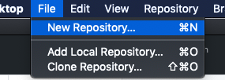
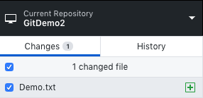
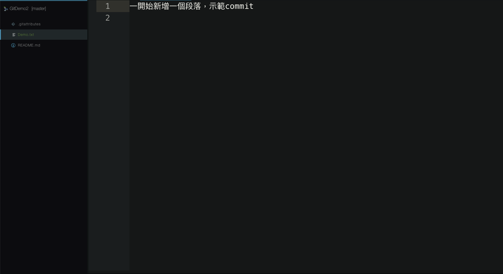
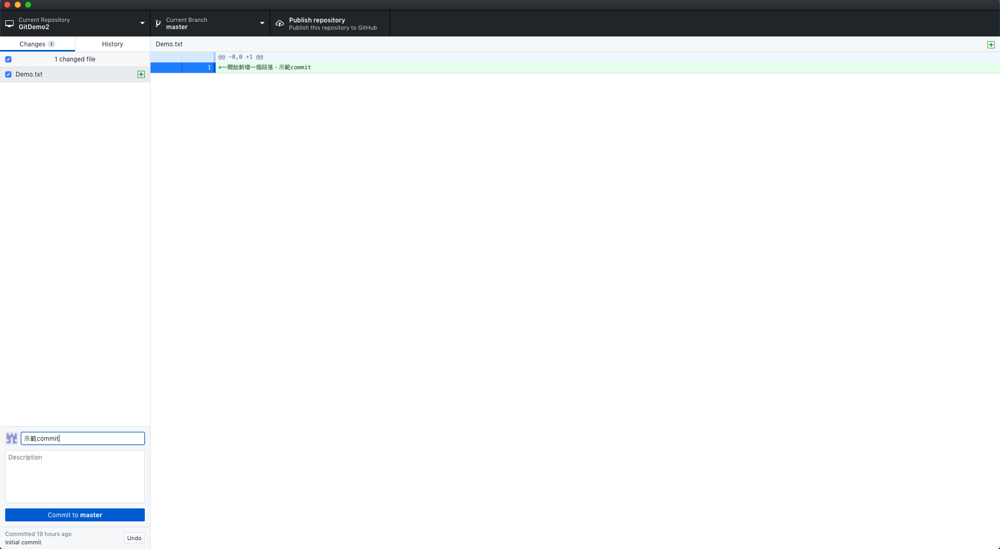
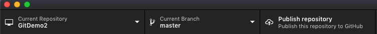
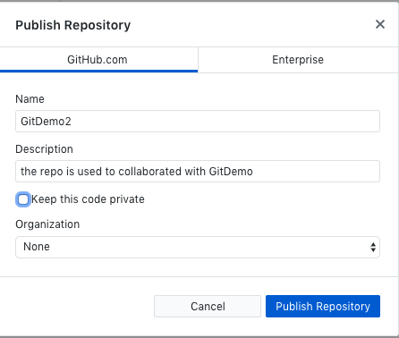
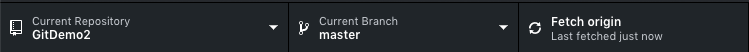

# (PART) Part II: Github Desktop {-} 

# Github Desktop-Individual

> 固定寫作模式，情境、截圖、graphiz、文字說明

## 基本名詞介紹{-}

- Untracked：指尚未加入版本控制的檔案或資料夾
- staged：有加入版本控制的檔案或資料夾

- local：本地端，指自己的電腦 
- remote：遠端（雲端），指GitHub

- fetch：取，接近get的意思，是聯繫本地端與遠端的橋樑。

## 本地端到雲端{-}

### git init{-}

> 小瑜把需要的軟體資源都裝好了，現在開始他計畫每次寫報告都要把檔案加到版本控制，他要怎麼做呢？一起來瞧瞧！

- 把尚未有版本控制的檔案或資料夾加進來

  - 小瑜新增了一個GitDemo2的資料夾

<div class="alert white">
截圖<a data-toggle="collapse" href="#collapseExample8" role="button" aria-expanded="false" aria-controls="collapseExample"><i class="fa fa-image"></i></a>
</div>

```{r, eval=TRUE, echo=FALSE}
library(htmltools)
HTML('
<div class="collapse" id="collapseExample8">
<h3>新增版本控制資料夾</h3>


選擇Add repository 則是把原本就已經有版本控制的檔案或資料夾，整合到Github Desktop的GUI介面，較方便操作。
</div>
     ')
```

```{r git_init, echo=FALSE}
library(DiagrammeR)
grViz("
digraph git_add {
 graph[layout = dot, rankdir = LR, overlap = false, fontsize = 8]

 node[shape = circle, fontname = Helvetica, style = dotted];
 Untracked;

 subgraph cluster_0{
 label = 'staged'; color = 'red'; fontcolor = 'red'; style ='dotted'

 node[shape = box, fontname = Helvetica, style = normal]
 GitDemo2
 } 

 Untracked -> GitDemo2[label = 'New repository'];
}
")
```

- 小瑜在裡面新增了一個檔案`Demo.txt`

<div class="alert white">
截圖<a data-toggle="collapse" href="#collapseExample9" role="button" aria-expanded="false" aria-controls="collapseExample"><i class="fa fa-image"></i></a>
</div>

```{r, eval=TRUE, echo=FALSE}
library(htmltools)
HTML('
<div class="collapse" id="collapseExample9">
<h3>在版本控制資料夾內新增檔案</h3>

</div>
     ')
```

```{r touch_new_file, echo=FALSE}
library(DiagrammeR)
grViz("
digraph git_add {
 graph[layout = dot, rankdir = LR, overlap = false, fontsize = 8]

 subgraph cluster_0{
 label = 'staged'; color = 'red'; fontcolor = 'red'; style = 'dotted'

 node[shape = box, fontname = Helvetica, style = normal]
 GitDemo2
 } 

 subgraph cluster_1{
 label = 'staged'; color = red; fontcolor = red; style = dotted

 subgraph cluster_2{
 label = 'GitDemo2'; color=black; style = normal; fontcolor = normal

 node[shape = box, fontname = Helvetica, style = normal]
 Demo_txt
 }
 } 
 
 GitDemo2 -> Demo_txt[label = 'initate new file']
 } 
")
```

### git commit{-}

> 小瑜在`Demo.txt`內新增了一些內容，差不多寫好一個段落了...

<div class="alert white">
截圖<a data-toggle="collapse" href="#collapseExample10" role="button" aria-expanded="false" aria-controls="collapseExample"><i class="fa fa-image"></i></a>
</div>

```{r, eval=TRUE, echo=FALSE}
library(htmltools)
HTML('
<div class="collapse" id="collapseExample10">
<h3>檔案新增內容</h3>

<h3>Github Desktop偵測到檔案變化</h3>

</div>
     ')
```

```{r}
#graphiz on commit
```

- 新增檔案後，每當撰寫文字（或程式開發）到一個段落時候，就需要進行`commit`。每一次`commit`，git都會計算一個專屬的、絕對不重複的版本號。有點類似郵戳認證的感覺。

- 切勿每天工作做完才`commit`，建議是完成一個小部分（也許畫完一個圖、修正完一個bug、建立好一個模型、寫好一個新的軟體功能）就`commit`一次。極端一點，可以每半小時到一小時`commit`一次。

### git push{-}

> 同時小瑜為了建立良好的習慣，每一次commit都會同步到GitHub

<div class="alert white">
截圖<a data-toggle="collapse" href="#collapseExample11" role="button" aria-expanded="false" aria-controls="collapseExample"><i class="fa fa-image"></i></a>
</div>

```{r, eval=TRUE, echo=FALSE}
library(htmltools)
HTML('
<div class="collapse" id="collapseExample11">
<h3>第一次推上雲端是publish</h3>

<h3>簡單設定好雲端的repo名稱（建議兩端相同）</h3>

<h3>往後同步都叫做fetch</h3>

</div>
     ')
```


- 完成`commit`後，代表一個新進度已經完成囉！接下來可以同步到GitHub給其他團隊成員（其他開源社群使用者）參考，或進一步使用。消極一點，至少幫自己做個雲端備份。

- 第一次雲端同步稱作`Pulish`，往後就是`fetch`

## 雲端到本地端{-}

### git pull{-}

> 有時候求個方便，小瑜想知道是否可以在GitHub編輯檔案，然後同步到自己電腦？

- 將自己在雲端GitHub新增點的東西，同步到本地端

- GitHub Desktop稍微省略了`push`和`pull`的差異，原則上只要用`push: 推上雲端`，`pull: 從雲端把東西拉下來`去理解即可。

### git clone (fork, then clone){-}

> 小瑜在GitHub發現別人整理的資料相當不錯，想要複製一份給自己再慢慢地參考，他要怎麼做呢？.....

- 先`Fork`，把有興趣的專案（repo），複製出屬於自己的一份

- 把整個專案從雲端拉下來到本地端的動作就叫做`clone`。

- 切記要先`Fork`，畢竟若直接clone別人的repo，後續修改檔案是無法同步回去雲端的，畢竟自己怎麼可能會有別人帳號本身的同步儲存權呢？

## 我反悔了{-}

小瑜

### revert{-}

## pull request{-}

### branch{-}

### 為什麼我們需要branch{-}

> the git flow