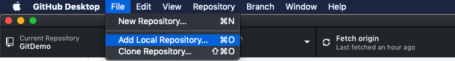

# (PART) Part II: Github Desktop {-} 

# Github Desktop-Individual

### 基本名詞介紹{-}

- Untracked：指尚未加入版本控制的檔案或資料夾
- staged：有加入版本控制的檔案或資料夾

- local：本地端，指自己的電腦 
- remote：遠端（雲端），指GitHub

### 本地端到雲端{-}

小瑜把需要的軟體資源都裝好了，現在開始他寫報告打字都會進行git版本控制，他都怎麼做呢？一起來瞧瞧！

#### git add{-}

<div class="alert white">
截圖<a data-toggle="collapse" href="#collapseExample8" role="button" aria-expanded="false" aria-controls="collapseExample"><i class="fa fa-image"></i></a>
</div>

```{r, eval=TRUE, echo=FALSE}
library(htmltools)
HTML('
<div class="collapse" id="collapseExample8">
<h3>第一部分</h3>

</div>
     ')
```

```{r git add, echo=FALSE}
library(DiagrammeR)
grViz("
digraph git_add {
 graph[layout = dot, rankdir = LR, overlap = false, fontsize = 10]

 node[shape = circle, fontname = Helvetica]
 Untracked

 node[shape = box, fontname = Helvetica, color = red, fontcolor = red]
 staged

 Untracked -> staged[arrowhead = normal];
}
")
```

#### git commit{-}

- 凡事

#### git push{-}

#### git pull{-}

### 雲端到本地端{-}

#### git clone (fork, then clone)

### 我反悔了{-}

#### revert{-}

### pull request{-}

#### branch{-}

#### 為什麼我們需要branch{-}

> the git flow