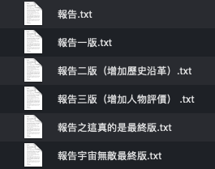

--- 
title: "Minimal-Git-demo"
author: "PoMingChen"
date: "`r Sys.Date()`"
site: bookdown::bookdown_site
documentclass: book
bibliography: [book.bib, packages.bib]
biblio-style: apalike
link-citations: yes
description: "This is a minimal example of git service through Github and the Github Desktop."
---

# 前言

### 為什麼Git值得學{-}

小瑜是一位社會人文科學相關主修的學生，學習上常常會需要寫報告，動則數千字到上萬字，以下是他管理檔案的方式，他承認有時候快被自己氣死.....你是不是有時也這樣XD

後來，因緣際會地留意到git這個東西，一套能夠讓開發者得以進行版本控制的程式。

往後小瑜是事半功倍從此樂逍遙，檔案內容追蹤管理都方便許多，看完這本電子書後你也可以！當然80%的時候啦XD，這本書著重理解觀念，不觸及進階功能與指令，原則上能應付80%的情境所需＝）

<div class="alert white">
cheatsheet截圖對照<a data-toggle="collapse" href="#collapseExample" role="button" aria-expanded="false" aria-controls="collapseExample"><i class="fa fa-image"></i></a>
</div>

```{r, eval=TRUE, echo=FALSE}
library(htmltools)
HTML('
<div class="collapse" id="collapseExample">
<h3>第一部分</h3>

</div>
     ')
```

### 編寫方式說明{-}

與其他教材稍有不同的是，這本書規劃先從輕鬆的Github平台環境介紹開始，版本控制的學習則用圖形化介面（GUI）的Github Desktop的操作來建立觀念，
也藉此暫緩一下要直接面對黑壓壓終端機敲打指令的壓迫感.....

若能透過Github Desktop來理解Git運作的原理，未來若是進到Command Line Interface(CLI)的Git指令也能夠快速上手。

預計分為幾個部分：

1. Github環境介紹
2. Github Desktop介紹與版本控制操作

### 基本要求{-}

1. 開設並登入Github帳戶
2. 下載[Github Desktop](https://desktop.github.com)
3. 下載[Atom](https://atom.io)


